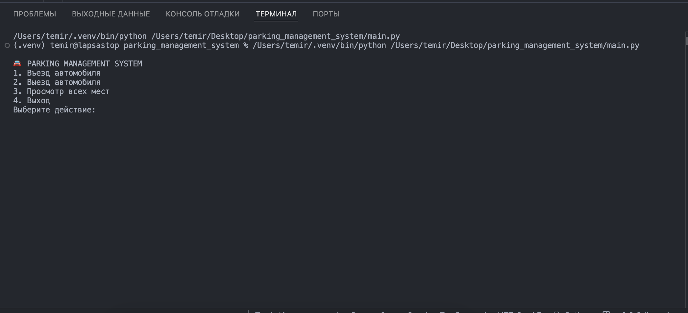
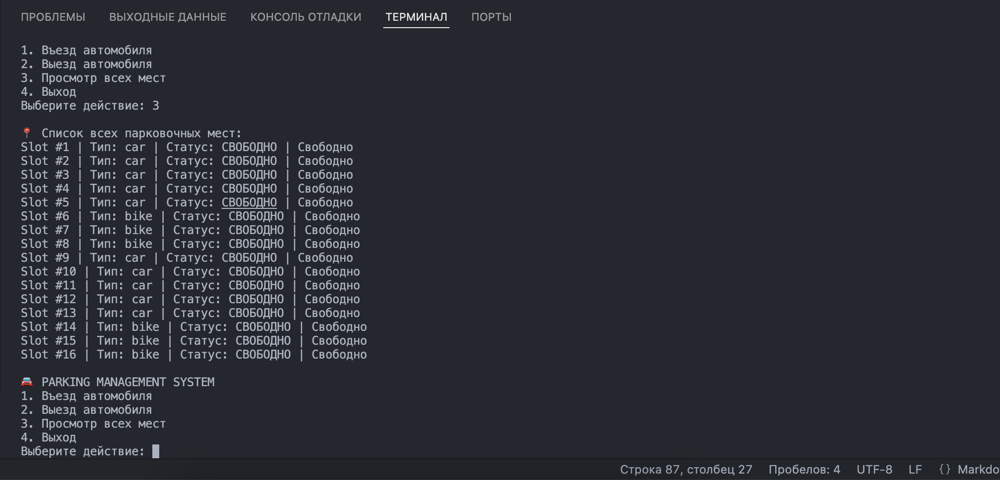
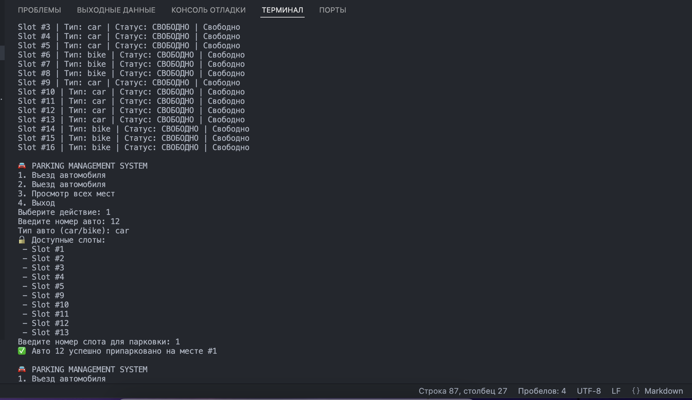
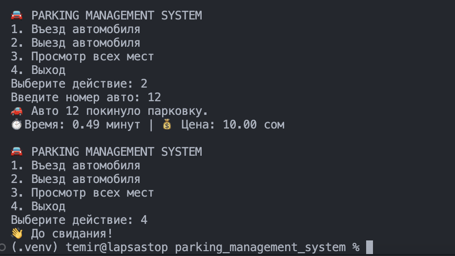

# Parking Management System

---

##  **Description:**
The Parking Management System is a console-based application developed to manage parking slots, vehicles, and tickets efficiently. It enables users to register vehicles, assign parking slots, track parking duration, calculate parking fees, and generate detailed reports. This system is ideal for small to medium-sized parking facilities.

---

##  **Project Requirements List:**

1. Register a vehicle and assign a parking slot.
2. Display all parking slots and their status (occupied/free).
3. Record entry and exit times for vehicles.
4. Calculate parking fees based on duration.
5. Generate reports of currently occupied slots.
6. Generate a list of all active tickets.
7. Provide daily revenue reports.
8. Display the number of vehicles by type (car/bike).
9. Track and manage parking slots (add, update, remove).
10. Display vehicle information by license plate.

---

##  **Team Members List:**

- Temir 

---

##  **Roles of Group Members:**

- **Temir:** Lead Developer - Responsible for project architecture, database management, and implementation of all features.

---

##  **Screenshots:**

### 1. Main Menu:

### 2. Parking Slot Status:

### 3. Vehicle Entry:

### 4. Fee Calculation:

---

##  **UML Class Diagram:**

The UML Class Diagram visualizes the relationships between key classes in the system, such as `Vehicle`, `ParkingSlot`, `Ticket`, and the associated DAO classes.  
[View UML Diagram](diagrams/UML_Class_Diagram.png)

---

##  **Weekly Meeting Documentation:**

- **Week 1:**
  - Discussed project structure and database schema.
  - Assigned roles and responsibilities.
  - Set up the repository and initialized the database.

- **Week 2:**
  - Implemented Vehicle and Ticket classes.
  - Created DAO classes for database interaction.
  - Set up basic command-line interface.

- **Week 3:**
  - Completed ticket fee calculation and reporting.
  - Implemented error handling and data validation.
  - Updated README and project documentation.

---

##  **Commit History:**

- [Commit 1](https://github.com/temirsas/parking_management_system/tree/7c6358eb87b2e8e641745c8d6ee07163ddd47797) - Initialized repository, added schema.sql and initialize_db.py.
- [Commit 2](https://github.com/temirsas/parking_management_system/tree/6d020871cb038bad6924894b22e3f30231360bc7) - Implemented Vehicle and Ticket classes.
- [Commit 3](https://github.com/temirsas/parking_management_system/tree/2aa440ea3441b0c5f8daf06dea6371cfb9f161e1) - Completed reporting module and added screenshots.
- [Commit 4](https://github.com/temirsas/parking_management_system/tree/19b31a522609e5ee935b8dc8befb13806a76579c) - add ParkingController and main CLI logic
- [Commit 5](https://github.com/temirsas/parking_management_system/tree/cff06ef4200e1920923b14cc11c5bee0dee73050) - add unit tests for models (ParkingSlot, Vehicle, Ticket)
- [Commit 6](https://github.com/temirsas/parking_management_system/tree/c90f0070cadd6f7fc60b5b700ad2b728e8618ea1) - little updates
- [Commit 7]() - README.md and screenshots

---

##  **Submission Link:**

- [GitHub Repository](https://github.com/temirsas/parking_management_system)

---

##  **Submission Date:**  
2025-05-20